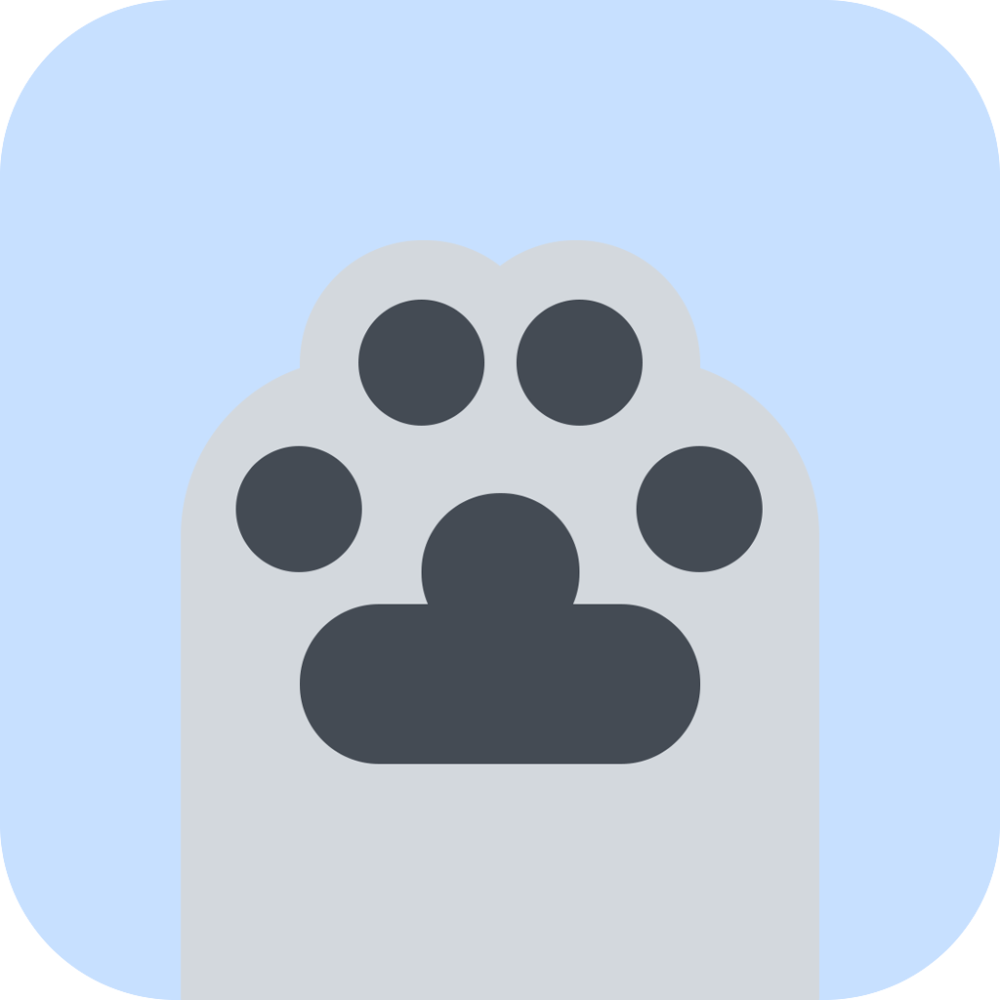

**English** | [简体中文](README_ZH_HANS.md)

# YumeBox

   

An open-source Android client based [mihomo](https://github.com/MetaCubeX/mihomo).

## Use

YumeBox currently only supports **Android 8.0 (API 26) and above systems**.

Please go to the Release page to download the installation package for the corresponding architecture: [Release](https://github.com/YumeYucca/YumeBox/releases) For more information, please visit the official website: [YumeBox](https://yumebox.oom-wg.dev/)
Override configuration syntax reference: [override document](https://yumebox.oom-wg.dev/override) If this project is helpful to you, please click Star. This is the motivation for continuous updates.

### Feedback and Suggestions

If you encounter a bug, please submit it on the Issues page:
[Issues](https://github.com/YumeYucca/YumeBox/issues)

If you have any ideas or suggestions for improvements, you can also submit them here
For more discussion and feedback, please join the group: [@OOM_WG](https://t.me/OOM_Group)

### Participate and contribute

If you want to make YumeBox better, please refer to [CONTRIBUTING](CONTRIBUTING.md). If you want to translate YumeBox into more languages, or improve the existing translation, please
Fork this project and create or update the corresponding translation file in the `locale/lang` directory.

### Special

**~~The author knows nothing about the code in this project. The code is either available or unavailable, there is no third case.~~**

And the [third-party](ThirdParty.md) libraries used in this project.

1. **Icon Copyright**: The copyright of the YumeBox application icon and brand assets belongs to the project owners.
2. **Fork Release Restrictions**:
   - Releases must not use the YumeBox project name.
   - Releases must not use the original YumeBox icon.
   - Releases must not include YumeBox's official issue feedback channels.