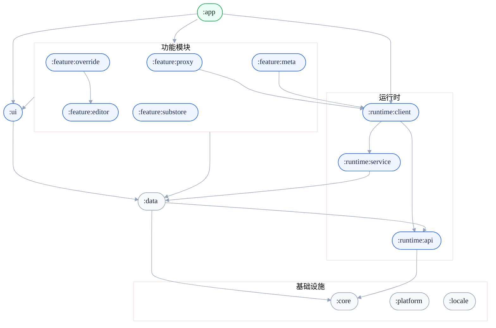
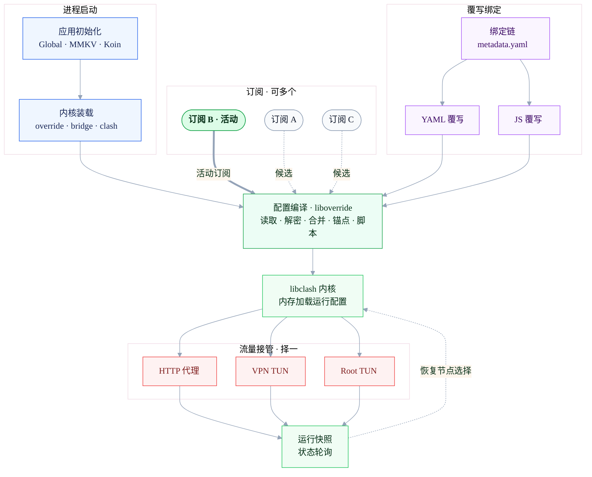

## 模块依赖

```mermaid
%%{init: {"theme": "base", "flowchart": {"curve": "basis", "htmlLabels": true, "nodeSpacing": 32, "rankSpacing": 48}, "themeVariables": {"primaryColor": "#ecfdf5", "primaryBorderColor": "#16a34a", "primaryTextColor": "#052e16", "lineColor": "#94a3b8", "fontFamily": "Inter, ui-sans-serif, system-ui"}}}%%
flowchart TB
    app([":app"])

    subgraph Feat["功能模块"]
        direction LR
        proxy([":feature:proxy"])
        override([":feature:override"])
        editor([":feature:editor"])
        meta([":feature:meta"])
        substore([":feature:substore"])
    end

    ui([":ui"])

    subgraph Rt["运行时"]
        direction LR
        client([":runtime:client"])
        service([":runtime:service"])
        rapi([":runtime:api"])
    end

    data([":data"])

    subgraph Base["基础设施"]
        direction LR
        core([":core"])
        platform([":platform"])
        locale([":locale"])
    end

    app --> Feat
    app --> ui
    app --> client
    Feat --> ui
    Feat --> data
    proxy --> client
    meta --> client
    override --> editor
    client --> service
    client --> rapi
    service --> data
    ui --> data
    data --> core
    data --> rapi
    rapi --> core

    classDef app fill:#ecfdf5,stroke:#16a34a,color:#052e16
    classDef mid fill:#eff6ff,stroke:#2563eb,color:#172554
    classDef base fill:#f8fafc,stroke:#94a3b8,color:#0f172a

    class app app
    class proxy,override,editor,meta,substore,ui,client,service,rapi mid
    class core,platform,locale,data base
```

## 启动流程

```mermaid
%%{init: {"theme": "base", "flowchart": {"curve": "basis", "htmlLabels": true, "nodeSpacing": 36, "rankSpacing": 50}, "themeVariables": {"primaryColor": "#ecfdf5", "primaryBorderColor": "#16a34a", "primaryTextColor": "#052e16", "lineColor": "#94a3b8", "fontFamily": "Inter, ui-sans-serif, system-ui"}}}%%
flowchart TB
    subgraph Boot["进程启动"]
        direction LR
        Init["应用初始化<br/>Global · MMKV · Koin"]
        Load["内核装载<br/>override · bridge · clash"]
        Init --> Load
    end

    subgraph Sources["订阅 · 可多个"]
        direction LR
        PA(["订阅 A"])
        PB(["订阅 B · 活动"])
        PC(["订阅 C"])
    end

    subgraph Override["覆写绑定"]
        direction LR
        OY["YAML 覆写"]
        Chain["绑定链<br/>metadata.yaml"]
        OJ["JS 覆写"]
        Chain --> OY
        Chain --> OJ
    end

    Compile["配置编译 · liboverride<br/>读取 · 解密 · 合并 · 锚点 · 脚本"]
    Kernel["libclash 内核<br/>内存加载运行配置"]

    subgraph Transport["流量接管 · 择一"]
        direction LR
        Http["HTTP 代理"]
        Tun["VPN TUN"]
        Root["Root TUN"]
    end

    Snap["运行快照<br/>状态轮询"]

    Load --> Compile
    PB ==>|活动订阅| Compile
    PA -. 候选 .-> Compile
    PC -. 候选 .-> Compile
    OY --> Compile
    OJ --> Compile
    Compile --> Kernel
    Kernel --> Http
    Kernel --> Tun
    Kernel --> Root
    Http --> Snap
    Tun --> Snap
    Root --> Snap
    Snap -. 恢复节点选择 .-> Kernel

    classDef boot fill:#eff6ff,stroke:#2563eb,color:#172554
    classDef profile fill:#f8fafc,stroke:#94a3b8,color:#0f172a
    classDef active fill:#dcfce7,stroke:#16a34a,color:#052e16,font-weight:bold
    classDef bind fill:#faf5ff,stroke:#a855f7,color:#3b0764
    classDef compiler fill:#ecfdf5,stroke:#16a34a,color:#052e16
    classDef core fill:#f0fdf4,stroke:#22c55e,color:#052e16
    classDef transport fill:#fef2f2,stroke:#ef4444,color:#7f1d1d

    class Init,Load boot
    class PA,PC profile
    class PB active
    class Chain,OY,OJ bind
    class Compile compiler
    class Kernel,Snap core
    class Http,Tun,Root transport
```
