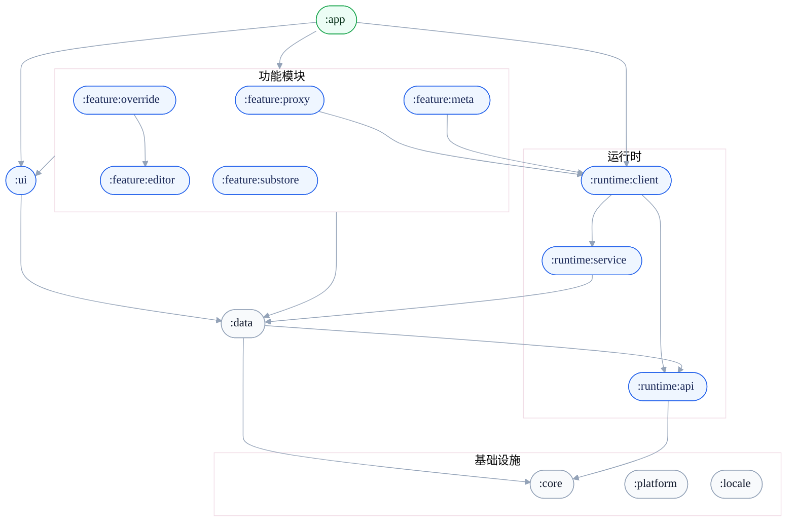
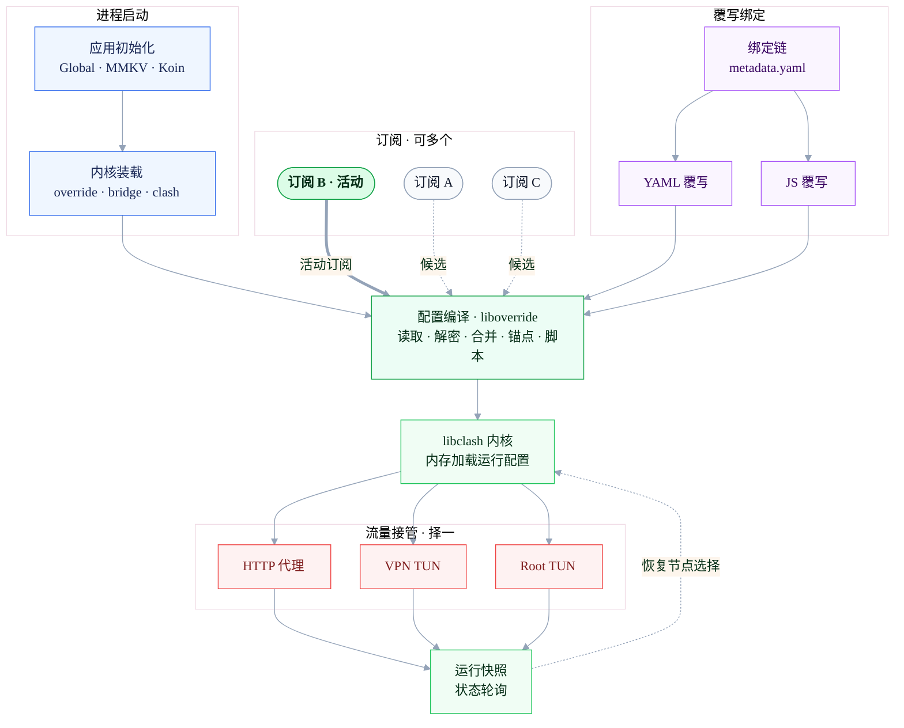

<Frame>
  
</Frame>

<Info>如果结局是分开，那相遇的意义是什么 --  **恋×シンアイ彼女**</Info>

## 起源

ClashMetaForAndorid UI 看久了换一个吧...

YumeBox 最早由 ClashMetaForAndroid 修改而来，后续在 2025 年 11 月 27 日发布第一个 `0.1.0` release，重写全部内容，Core 部分由 ClashMetaForAndroid 迁移而来
所以在大致上保持高度相似，并非完全相同

值得注意的是，**YumeBox 核心理念为尽可能少的覆写掉原配置中的内容，非必要不进行覆写，拒绝将 [字段](https://wiki.metacubex.one/config/) 覆写为模糊不清，含糊其辞的开关，提供相对的便利行为**

## 发展

YumeBox 迭代至今逐渐趋于稳定，未来将一直保持 **开源 & 免费**，承诺不会有任何收集隐私及上传或广告行为。

### **2026 年6 月 1 日**

***为保持项目良好的发展，目前已去除签名校验部分部分，此外添加了部分条款，仅作用于Fork发行版，请不要为此项目带来混淆歧义或多余负担***

- YumeBox 应用图标及品牌标识的版权归项目所有者所有
- Fork 发行版限制
    - 发行版不得使用 YumeBox 项目名称
    - 发行版不得沿用 YumeBox 原始图标
    - 发行版不得包含 YumeBox Issue 反馈渠道

## 下载
如果需要历史版本，请查看 [更新日志](/update/history.mdx)
<Card title="下载" icon="square-arrow-down" horizontal href="https://github.com/YumeYucca/YumeBox/releases">
   前往 Github Release 下载安装包
</Card>

## 其他资料

<CardGroup cols={2}>
    <Card title="Telegram 群组" icon="message-circle" href="https://t.me/OOM_Group">
        加入讨论，获取最新消息。
    </Card>

    <Card title="配置文档" icon="settings" href="https://wiki.metacubex.one/config/">
        查看 mihomo 配置说明与最佳实践。
    </Card>
</CardGroup>

## 模块依赖

## 启动流程

