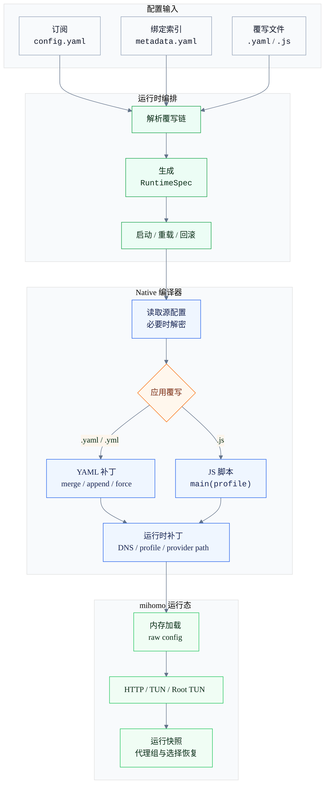

覆写（Override）位于订阅配置与 mihomo 加载之间，用于在启动时合并本机配置、运行时补丁和脚本化处理。

订阅文件不会被改写。每次启动或重载时，YumeBox 会读取当前订阅，按绑定顺序应用覆写，再把结果加载到 mihomo。

## 适用场景

- 固定本机端口、DNS、日志级别等运行参数。
- 在订阅规则前后追加本机规则。
- 调整 TUN、provider path、外部控制器等运行时字段。
- 用 JavaScript 根据条件生成配置片段或读取本地 HTTP 数据。

## 覆写格式

| 格式 | 定位 | 适合场景 |
|------|------|----------|
| YAML | 声明式补丁 | 固定配置、规则追加、DNS/TUN 调整 |
| JavaScript | 脚本化转换 | 条件逻辑、远程片段、批量处理、调试输出 |

<Warning>
当前覆写文件只按 `.yaml`、`.yml`、`.js` 处理。旧版 JSON-only 写法不再对应当前实现。
</Warning>

## 快速示例

```yaml
mode: rule
log-level: info

dns:
  enable: true
  nameserver:
    - https://dns.alidns.com/dns-query
    - https://doh.pub/dns-query

rules-end:
  - DOMAIN-SUFFIX,example.com,DIRECT
```

这段 YAML 会递归合并 `dns` 对象，并把规则追加到原 `rules` 末尾。更多语义见 [语法参考](/override/fields)。

## 绑定与执行顺序

<Steps>
  <Step title="创建覆写">
    在覆写页面创建 YAML 或 JS 配置。
  </Step>
  <Step title="绑定订阅">
    将一个或多个覆写绑定到目标订阅。
  </Step>
  <Step title="启动或重载">
    YumeBox 解析绑定链，构建 `RuntimeSpec`，再进入 native 编译。
  </Step>
  <Step title="加载内核">
    编译结果以内存形式加载到 mihomo，随后启动 HTTP、TUN 或 Root TUN。
  </Step>
</Steps>

多个覆写按绑定顺序执行。后面的覆写会基于前一个覆写的结果继续处理。

## 编译链路



## 运行时约束

- 正常启动使用 native in-memory compile-and-load，不写出明文 `runtime.yaml`。
- 历史版本遗留的 `runtime.yaml` 会在启动前清理。
- age 加密订阅会在 native 编译层解密，JS 日志会隐藏敏感内容。
- JS 覆写失败时只跳过当前脚本，并保留执行脚本前的配置。
